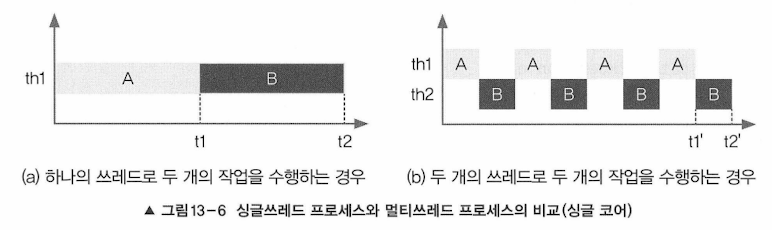
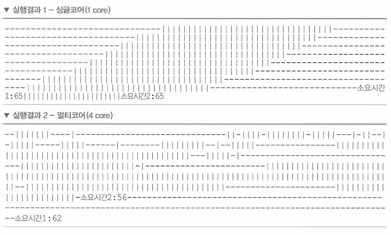
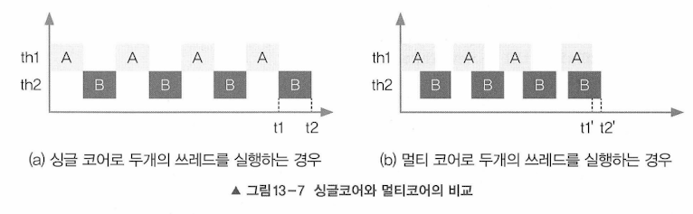

## 싱글쓰레드 프로세스와 멀티쓰레드 프로세스의 차이(심화)

- 두 개의 작업을 하나의 쓰레드(th1)로 처리하는 경우
  - 하나의 쓰레드로 두  작업 처리 시 한 작업 마친 후 다른 작업 시작
- 두 개의 작업을 두 개의 쓰레드(th1, th2)로 처리하는 경우
  - 두 개의 쓰레드로 두 작업 처리 시 짧은 시간동안 2개의 쓰레드 번갈아 가면서 작업 수행(시분할)
- 두 경우 모두 수행 시간이 거의 같은데, 실제로 실행했을 때는 싱글 쓰레드로 작업한 시간으 더 짧다.
  - 그 이유는 쓰레드 간의 작업 전환(context switching)에 시간이 걸리기 때문

그래서 싱글 코어에서 단순히 CPU만을 사용하는 작업이라면 멀티쓰레드보다 싱글쓰레드가 더 효율적

- 두 개의 쓰레드로 작업하는데도 더 많은 시간이 걸린 이유는 2가지
1. 두 쓰레드가 번갈아가면서 작업 처리하여 쓰레드 간의 작업전환시간이 소요
2. 한 쓰레드가 화면 출력하고 있는 동안 다른 쓰레드는 출력이 끝나기를 기다려야 하는 대기시간 소요

- 실행 결과 싱글 코어와 멀티 코어
- 싱글 코어
  - 멀티쓰레드라도 하나의 코어가 번갈아가면서 작업 수행하면 두 작업 절대 겹치지 않음
- 멀티 코어
  - 멀티쓰레드로 두 작업 수행하면 동시에 두 쓰레드가 수행되는 경우 있음
  - 쓰레드가 서로 경쟁하게 되는 것

- 병행 vs 병렬
  - 병행 : 여러 작업 동시 진행
  - 병렬 : 하나의 작업 여러 쓰레드가 나눠서 처리

- 실행마다 다른 결과 나오는 이유
  - 실행 중인 예제프로그램(프로세스)이 OS의 프로세스 스케줄러의 영향을 받음
  - 그래서 쓰레드가 이런 불확실성을 가지고 있다는 것을 염두해야 한다.
  - 자바가 OS 독립적이라고 하지만 실제로 OS 종속적인 부분이 몇 개 있는데 그 중 하나가 쓰레드이다.

- 두 쓰레드가 서로 다른 자원을 사용하는 작업
  - 싱글 쓰레드 프로세스보다 멀티 쓰레드 프로세스가 더 효율적
  - 예) 사용자에게 데이터 입력받기, 네트워크로 파일 주고받기, 프린터로 파일 출력하기
  - 외부기기와 입출력을 필요로 하는 경우 해당