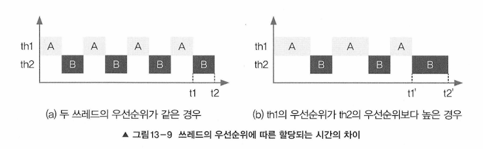

- 쓰레드는 우선순위(priority)라는 속성(멤버변수)을 가지고 있음
- 이 우선순위에 따라 쓰레드가 얻는 실행시간이 다름
- 쓰레드가 수행하는 작업의 중요도에 따라 쓰레드의 우선순위를 서로 다르게 지정하여 특정 쓰레드에 더 많은 작업 시간 할당할 수 있음

예) 파일 전송 기능과 메신저의 경우
- 파일 다운로드 처리 쓰레드보다 채팅 전송하는 쓰레드의 우선순위가 더 높아야 사용자가 지연감을 덜 느낌
- 시각적인 부분이나 사용자에 대한 반응성이 중요한 작업은 쓰레드의 우선순위가 높아야 함

## 쓰레드의 우선순위 지정하기
```java
void setPriority(int newPriority) // 쓰레드의 우선순위 지정한 값으로 변경
int getPriority() // 쓰레드의 우선순위 반환

public static final int MAX_PRIORITY = 10 // 최대 우선순위
public static final int MIN_PRIORITY = 1 // 최소 우선순위
public static final int NORM_PRIORTY = 5 // 보통 우선순위
```
- 쓰레드가 가질 수 있는 우선순위 범위는 1 ~ 10이며 숫자가 높을수록 우선순위 높음
- main 메서드 수행하는 쓰레드의 우선순위는 5
  - 그래서 main 내에 생성하는 쓰레드의 우선순위는 자동으로 5가 됨


- 우선순위가 같으면 각 스레드에 거의 같은 실행시간이 주어짐
- 우선순위가 다르다면 높은 우선순위 th1에게 상대적으로 th2보다 많은 실행시간이 주어짐

### 주의
- 멀티코어라고 해도 OS마다 다른 방식으로 스케쥴링하므로 다른 결과 얻을 수 있음
- 굳이 우선순위에 차등을 두어 쓰레드를 실행하려고 하면 특정 OS의 스케줄링 정책과 JVN의 구현을 직접 확ㅇ니해야 함
- 하지만 확인한다 하더라도 OS의 스케줄러에 종속적이라 어느 정도 예측만 가능할 뿐 정확하지는 않음
- 차라리 쓰레드 우선순위 부여하는 대신 작업에 우선순위를 두어 PriorityQueue에 저장하고 순차적으로 처리하는 것이 나을 수 있음