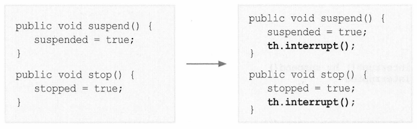

## 쓰레드의 실행제어
- 쓰레드 프로그래밍이 어려운 이유
  - 동기화(synchronization)
  - 스케줄링(scheduling)
- 우선순위를 통해 쓰레드간의 스케줄링을 하는 법을 배웠지만 이것만으로는 부족
- 효율적인 멀티쓰레드 프로그램을 만들기 위해서는 보다 정교한 스케줄링을 통해 프로세스에게 주어진 자원과 시간을 여러 쓰레드가 낭비없이 사용하도록 프로그래밍해야 함
- 쓰레드의 스케줄링을 잘하기 위해서는 쓰레드의 상태와 관련 메서드를 잘 알아야 함
- 스케줄링 메서드는 뒤에서 배울 것

## 쓰레드 상태

| 상태                      | 설명                                                                     |
|:------------------------|:-----------------------------------------------------------------------|
| NEW                     | 쓰레드 생성되고 아직 start() 호출되지 않은 상태                                         |
| RUNNABLE                | 실행 중에 또는 실행 가능한 상태                                                     |
| BLOCKED                 | 동기화 블럭에 의해 일시정지된 상태(lock이 풀릴 때까지 기다리는 상태)                              |
| WATING,<br>TIMED_WATING | 쓰레드의 작업이 종료되지는 않았지만 실행가능하지 않은 일시정지 상태<br/>TIMED_WATING은 일시정지시간이 지정된 경우 |
| TERMINATED              | 쓰레드의 작업이 종료된 상태                                                        |

> (참고)<br/>
> resume(), stop(), suspend() 메서드는 쓰레드를 교착상태로 만들기 쉬워서 deprecated 됨

### 쓰레드의 상태 변화 과정


1. 쓰레드 생성하고 `start()` 호출 > 실행 대기열에 저장 > 실행대기열(큐 구조로 되어 있음)에 들어온 쓰레드가 차례로 실행
2. 실행대기상태에 있다가 자신의 차례가 되면 실행상태가 됨
3. 주어진 실행시간이 다되거나 `yield()`를 만남 > 다시 실행대기상태 > 다음 차례 스레드 실행상태로 바뀜
4. 실행 중 `suspend()`, `sleep()`, `wait()`, `join()`, I/O block 에 의해 일시정지상태 될 수 있음
   - I/O block : 입출력작업에서 발생하는 지연 상태
     - 예) 사용자 입력을 기다리는 경우
     - 이런 경우 일시정지 상태에 있다가 사용자가 입력을 마치면 다시 실행대기 상태로 변경
5. 지정된 일시정지시간이 다되거나(time-out), `notify()`, `resume()`, `interrupt()`가 호출되면 일시정지상태를 벗어나 다시 실행대기열에 저장
6. 실행을 모두 마치거나 `stop()` 호출되면 쓰레드 소멸

## 쓰레드 메서드
### sleep(long millis) - 일정시간동안 쓰레드 멈춤
```java
static void sleep(long millis)
static void sleep(long millis, int nanos)
```
- 밀리세컨드(1000분의 1초)와 나노세컨드(10억분의 1초)의 시간 단위로 세밀하게 값 지정 가능
- 하지만 어느 정도 오차 발생 가능
예)
```java
try{
    Thread.sleep(1, 500000); // 쓰레드를 0.0015초 멈추게 함
} catch(InterruptedException e) {}
```
- sleep()에 의해 일시정지 상태가 된 쓰레드는 지정된 시간이 다 되거나 Interrupt() 가 호출(InterruptedException 발생)되면 실행 대기 상태가 됨
- 그래서 sleep 호출 시에는 **항상 try-catch 문으로 예외처리** 해야함
- 매번 예외처리 하기 힘들기 때문에 아래와 같이 try-catch 문까지 포함하는 새로운 메서드 만들어서 사용하기도 함
```java
void delay(long millis) {
    try {
        Thread.sleep(millis);
    } catch (InterruptedException e) {}
}
```

```java
th1.start();
th2.start();

try {
     th1.sleep(2000);
} catch (InterruptedException e) {}
```
- 위의 결과는 th1 > th2 > main 순서로 종료되었다.
- 근데 th1.sleep(2000); 을 호출하였으므로 쓰레드 th1이 2초 간 작업을 멈추므로 가장 늦게 종료되어야 하는 거 아닌가?
- 그 이유는 sleep()이 항상 현재 실행 중인 쓰레드에 대해서 작동하기 때문이다
  - 실제로 영향을 받는 것은 main 메서드를 실행하는 main 쓰레드
  - 그래서 sleep() 은 static 으로 선언되어 있고 참조변수를 이용해 호출하기 보다는 `Thread.sleep(2000)`와 같이 해야 함

### interrupt() 와 interrupted() - 쓰레드의 작업을 취소한다.
- 큰 파일을 다운로드 받을 때 시간이 너무 오래 걸리면 중간에 다운로드를 포기하고 취소할 수 있도록 해야 한다.
- interrupt()는 쓰레드에게 작업을 멈추라고 요청한다
  - 단지 멈추라고 요청만 하는 것이지 쓰레드 강제로 종료시키지는 못한다
  - 그저 쓰레드의 interrupted 상태(인스턴스 변수)를 바꾸는 것일 뿐
- interrupted()는 쓰레드에 대해 interrupt()가 호출되었는지 알려준다
  - interrupt()가 호출되지 않았다면 false, 호출되었다면 true 반환

```java
void interrupt() // 쓰레드의 interrupted 상태를 false -> true 로 변경
boolean isInterrupted() // 쓰레드의 interrupted 상태 반환
static bollean interrupted() // 현재 쓰레드의 interrupted 상태 반환 후 false 로 변경
```
- 쓰레드가 sleep(), wait(), join()에 의해 일시정지 상태에 있을 때
- 해당 쓰레드에 대해 interrupt()를 호출
- sleep(), wait(), join()에서 InterruptedException이 발생
- 쓰레드는 실행대기 상태로 바뀜
- 즉, 멈춰있던 쓰레드를 깨워서 실행 가능 상태로 만드는 것

### suspend(), resume(), stop()
- suspend() : sleep() 처럼 스레드 멈춤
- suspend()에 의해 정지된 쓰레드는 resume()을 호출해야 다시 실행대기 상태가 됨
- stop()은 호출되는 즉시 쓰레드 종료됨
- suspend()와 stop()은 교착상태를 일으키기 쉽게 작성되어 deprecated 되었다.
  - 하위 호환성을 위해 삭제하지 않은 것일뿐 사용하면 안되는 것

### yield() - 다른 쓰레드에게 양보
- 자신에게 주어진 실행시간을 다음 차례의 쓰레드에게 양보(yield)한다.
- 스케쥴러에 의해 1초 실행시간을 할당받은 쓰레드가 0.5초의 시간동안 작업한 상태에서
- yield() 호출되면 나머지 0.5초는 포기하고 다시 실행대기상태가 된다.
- yield()와 interrupt()를 적절히 사용하면 프로그램의 응답성을 높이고, 효율적인 실행이 가능하게 할 수 있다.


- yield()와 interrupt()를 추가하여 효율과 응답성 향상
- 왼쪽 코드에서 만일 supended의 값이 true 일때 잠시 실행을 멈추게 한 상태라면 쓰레드는 주어진 실행시간을 그저 while문을 의미없이 돌면서 낭비
  - 이런 상황을 '바쁜 대기 상태' 라고 함
- 오른쪽 코드는 같은 경우에 yield()를 호출하여 남은 실행시간을 while문에서 낭비하지 않고 다른 쓰레드에 양보(yield)하게 되므로 더 효율적!


- stop()이 호출되었을 때 Thread.sleep(1000)에 의해 쓰레드가 일시정지 상태에 머물러 있는 상황이라면, stopped의 값이 true 로 바뀌어도 쓰레드가 정지될 때까지 최대 1초 지연이 생길 것
- 그러나 같은 상황에서 interrupt()를 호출하면 sleep()에서 InterruptedException이 발생하여 즉시 일시정지 상태에서 벗어나게 되므로 응답성이 좋아짐

### join() - 다른 스레드의 작업을 기다린다
- 자신이 하던 작업을 잠시 멈추고 다른 쓰레드가 지정된 시간동안 작업을 수행하도록 할 때 join()을 사용
```java
void join()
void join(long millis)
void join(long millis, int nanos)
```
- 시간을 지정하지 않으면 해당 쓰레드가 작업 마칠 때{까지 기다림
- **작업 중에 다른 쓰레드의 작업 먼저 수행되어야 할 때 join() 사용**
- join() 도 sleep() 처럼 interrupt()에 의해 대기상태에서 벗어날 수 있으며, join()이 호출되는 부분을 try-catch()로 감싸야 함
- sleep 과 유사하지만, join()은 현재 쓰레드가 아닌 특정 쓰레드에 대해 동작하므로 static 메서드가 아닌 것

ThreadEx20 예제
- JVM의 가비지 컬렉터를 간단히 구현한 것
- 실행 결과를 보면 MAX_MEMORY가 1000임에도 불구하고 usedMemory의 값이 1000을 넘는 것을 볼 수 있음
  - gc()가 수행되기 전에 main 쓰레드 작업이 수행되어 메모리 사용하기 때문에 발생
- 그래서 쓰레드 gc를 깨우는 interrupt() 뿐만 아니라 join()을 이용해서 쓰레드 gc가 작업할 시간 확보해줘야 함


> 가비지 컬렉터와 같은 데몬 쓰레드의 우선순위를 낮추기 보다 sleep()을 이용해서 주기적으로 실행되도록 하다가 필요할 때 interrupt()를 호출하여 즉시 가비지 컬렉션이 이루어지도록 하는 것이 좋음
> 그리고 필요하다면 join() 도 같이 사용