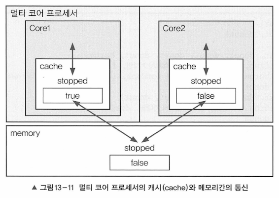
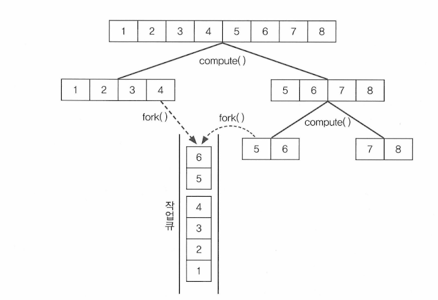
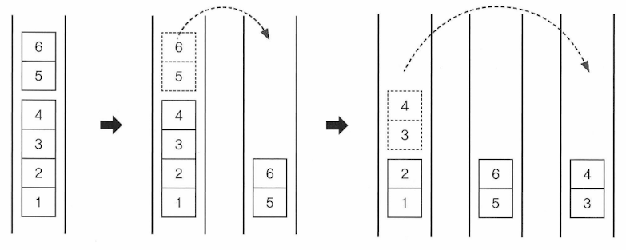

## 쓰레드의 동기화
- 멀티쓰레드 프로세스
  - 여러 쓰레드가 같은 프로세스 내의 자원을 공유해서 작업
  - 서로의 작업에 영향을 주게 됨
  - ThreadA가 작업하던 도중 ThreadB에게 제어권이 넘어갔을 때, ThreadA가 작업하던 공유데이터를 ThreadB가 임의로 변경 - ThreadA가 다시 제어권을 받아서 나머지 작업 수행할 때 의도와 다른 결과 없을 수 있음
- 그래서 한 쓰레드가 특정 작업을 끝마치기 전까지 다른 쓰레드에 의해 방해받지 않도록 하는 것이 필요
  - 그렇게 도입된 개념이 바로 '임계영역(cirtical section)'과 '잠금(락, lock)'이다.
- 공유 데이터를 사용하는 코드 영역을 임계 영역으로 정해놓고, 공유 데이터가 가지고 있는 lock을 획든한 단 하나의 쓰레드만 이 영역 내의 코드를 수행할 수 있게 하는 것
- 해당 쓰레드가 임계 영역 내의 모든 코드를 다 수행했다면 lock을 반납해야만 다른 쓰레드가 반납된 lock을 획득해서 임계 영역의 코드를 수행할 수 있음
- 이렇게 한 쓰레드가 진행 중인 작업을 다른 쓰레드가 간섭하지 못하게 막는 것을 '쓰레드 동기화(synchronization)'라고 한다.

### synchronized를 이용한 동기화
- 가장 간단한 동기화 방법 `synchronized` 키워드 이용 방법
```java
// 1. 메서드 전체를 임계 영역으로 지정
public synchronized void calcSum() {
    // 임계 영역
}
// 2. 특정한 영역을 임계 영역으로 지정 : 메서 내의 코드 일부를 블럭{} 으로 감싸고 앞에 키워드 붙이는 것
synchronized(객체의 참조변수) {
    // 임계 영역    
}
```
1. 쓰레드는 synchronized 메서드가 호출된 시점부터 해당 메서드가 포함된 객체의 lock 을 얻어 작업을 수행하다가 메서드가 종료되면 lock 을 반환
2. 참조변수는 락을 걸고자하는 객체를 참조하는 것이어야 한다. 이 블럭 영역 안으로 들어가면서 쓰레드는 지정된 객체의 lock 을 얻고, 이 블럭을 벗어나면 반납한다.

- 두 방법 모두 lock 의 획득과 반납이 모두 자동적으로 이루어진다. 임계영역만 설정해주면 되는 것
- 임계영역을 최소화해서 보다 효율적인 프로그램이 되도록 해야 함

### wait() 와 notify()
- 특정 쓰레드가 객체의 락을 가진 상태로 오랜 시간을 보내지 않도록 하는 것 중요
  예) 계좌에 출금할 돈이 부족하여 한 쓰레드가 락을 보유한 채로 돈이 입금될 때까지 기다리는 상황
- 이런 상황을 개선하기 위해 고안된 것 wait(), notify()
  - 동기화된 임계 영역의 코드를 수행하다 작업을 더 진행할 상황이 아니면, wait()를 호출하여 쓰레드가 락을 반납하고 대기
  - 다른 쓰레드는 락을 얻어 해당 객체에 대한 작업 수행
  - 나중에 다시 작업을 재개할 상황이 되면 notify()를 호출하여 다시 락을 얻어 작업 진행
- 여기서 차이가 있다면, 오래 기다린 쓰레드가 락을 얻는다는 보장이 없다는 것
  - wait() 호출 : 실행 중이던 쓰레드 해당 객체의 대기실(waiting pool)에서 통지를 기다림
  - notify() 호출 : 해당 객체의 대기실에 있던 모든 쓰레드 중 임의의 쓰레드만 통지 받음
  - notifyAll() 호출 : 대기 중인 모든 쓰레드에게 통보를 하지만, 그래도 락을 얻을 수 있는 것은 하나의 쓰레드. waiting pool에 대기 중인 쓰레드만 해당
```
wait(), notify(), notifyAll()
- Object에 정의됨
- 동기화 블록 내에서만 사용 가능
- 보다 효율적인 동기화를 가능하게 함
```

ThreadWaitEx1 예제
- 여기서 두 가지 종류의 예외가 발생
1. ConcurrentModificationException
   - 요리사(Cook) 쓰레드가 테이블에 음식을 놓는 도중에 손님(Customer) 쓰레드가 음식을 가져가려했기 때문에 발생
2. IndexOutOfBoundsException
   - 다른 손님 쓰레드가 먼저 음식을 낚아채버려서 있지도 않는 음식을 가져가는 도중에 다른 손님 쓰레드가 먼저 음식을 낚아채버려서 있지는 않는 음식을 테이블에서 제거하려고 했기 때문에 발생

이런 예외가 발생하는 이유
- 여러 쓰레드가 테이블을 공유하는데 동기화하지 않아서

ThreadWaitEx3 예제
- wait() 와 notify() 를 추가했다
- 테이블에 음식이 없을 때뿐만 아니라 원하는 음식이 없을 때도 손님이 기다리도록 바꿈
- 여기에도 문제 존재
  - 테이블 객체의 waiting pool에 요리사 쓰레드와 손님 쓰레드가 같이 대기한다는 것
  - notify()가 호출되었을 때 요리사/손님 중 누구한테 통지할지 알 수 없다.
  - 테이블의 음식이 줄어서 notify() 호출할 때는 요리사 쓰레드가 통지를 받아야 하는데, 만약 손님이 받으면 lock 을 얻어도 다시 waiting pool에 들어가게 됨

#### 기아 현상과 경쟁 상태
- 최악의 경우 요리사 쓰레드는 계속 통지 받지 못하고 계속 기다림
  - 이런 현상을 기아현상(starvation)이라고 함
  - 이 현상을 막으려면 notify() 대신 notifyAll()을 사용
  - 모든 쓰레드에 통지하면 손님 쓰레드는 다시 waiting pool에 들어가도 결국 lock을 얻어서 작업 진행이 가능하므로
- notifyAll() 로 기아현상은 막았지만, 손님 쓰레드까지 통지를 받아서 불필요하게 요리사 쓰레드와 lock을 얻기 위한 경쟁을 함
  - 여러 쓰레드가 lock을 얻기 위해 경쟁하는 것을 경쟁 상태(race condition)이라고 함
  - 이를 개선하기 위해서는 요리사 쓰레드와 손님 쓰레드를 구별해서 통지하는 것이 필요

그래서 Lock 과 Condition 이 등장함!

### Lock 과 Condition 을 이용한 동기화
- synchronized 방식
  - 자동적으로 lock 잠금/풀림 관리해서 편리
  - 블럭 내에서 예외 발생해도 자동적으로 풀림
  - 하지만, 같은 메서드 내에서만 lock 걸 수 있다는 제약이 불편
- 그럴 때 lock 클래스 사용

#### 종류
```
ReentrantLock : 재진입이 가능한 lock. 가장 일반적인 배타 lock
ReentrantReadWriteLock : 읽기에는 공유적이고, 쓰기에는 배타적인 lock
StampedLock : ReentrantReadWriteLock에 낙관적인 lock 기능 추가
```
1. ReentrantLock
   - 가장 일반적 lock
   - reentrant(재진입할 수 있는) 단어가 붙은 이유는 특정 조건에서 lock 을 풀고 나중에 다시 lock 을 얻고 임계영역으로 들어와서 이후 작업을 수행할 수 있으므로
   - 지금까지 사용했던 lock 과 일치
2. ReentrantReadWriteLock
   - 읽기를 위한 lock 과 쓰기를 위한 lock 을 제공
   - 읽기 lock 이 걸려있으면, 다른 쓰레드가 읽기 lock 을 중복해서 걸고 읽기 수행 가능!
   - 그러나 읽기 lock 이 걸린 상태에서 쓰기 lock 은 불가능
3. StampedLock
   - lock 을 걸거나 해지할 때 스탬프(long 타입의 정수값)를 사용
   - 읽기와 쓰기를 위한 lock 외에 '낙관적 읽기 lock'이 추가된 것
   - 낙관적 읽기 lock 은 읽기 lock 이 걸려있을 때, 쓰기 lock 에 의해 바로 풀릴 수 있는 것
   - 무조건 읽기 lock 을 걸지 않고, 쓰기와 읽기가 충돌할 때만 쓰기가 끝난 후 읽기 lock 을 거는 것

```java
int getBalance() {
    long stamp = lock.tryOptimisticRead(); // 낙관적 읽기 lock
  
    int curBalance = this.balnce; // 공유 데이터인 balance 읽어옴
  
    if(!lock.validate(stamp)) { // 쓰기 lock에 의해 낙관적 읽기 lock 이 풀렸는지 확인
        stamp = lock.readLock(); // lock 이 풀렸으면, 읽기 lock 을 얻기 위해 기다림
        
        try {
            curBalance = this.balance; // 공유데이터 다시 읽기
        } finally {
            lock.unlockRead(stamp); // 읽기 lock 을 푼다.
        }
    }
    
    return curBalance; // 낙관적 읽기 lock 이 풀리지 않았으면 곧바로 값을 반환
}
```

**ReentrantLock 생성자**
- 두 개의 생성자를 가짐
```
ReentrantLock()
ReentrantLock(boolean fair)
```
- 생성자의 매개변수를 true 로 주면, lock 이 풀렸을 때 가장 오래 기다린 쓰레드가 lock 을 획득
- 공정하게 처리하지만, 어떤 쓰레드가 가장 오래 기다렸는지 확인하는 과정을 거치므로 성능은 저하
- 공정하게 처리하지 않아도 되므로 성능을 택하는게 일반적
```
void lock() : lock 을 잠금
void unlock() : lock 을 해지
boolean isLocked() : lock 이 잠겼는지 확인
```
- Lock 클래스들은 수동으로 잠금/해제 해줘야 함
- 임계영역 내에서 예외 발생 시 return 으로 나가게 되면 lock 이 풀리지 않을 수 있으므로 unlock()은 try-catch 로 감싸는 것이 일반적
- 그러나 대부분의 경우 lock() & unlock() 대신 synchronized 사용할 수 있음
```
boolean tryLock()
boolean tryLock(long timeout, TimeUnit unit) throws InterruptException 
```
- 다른 쓰레드에 의해 lock 이 걸려있으면 lock 을 얻으려고 기다리지 않거나 지정된 시간만큼만 기다림
- lock 을 얻으면 true, 얻지 못하면 false
- 응답성이 중요한 경우, tryLock()을 이용해서 지정된 시간동안 lock 을 얻지 못하면 다시 작업 시도할 건지 포기할 것인지 사용자가 결정할 수 있도록 하는게 좋음
- InterruptedException 을 발생시킬 수 있음
  - 이건 기다리는 중에 interrupt()에 의해 작업을 취소될 수 있도록 코드 작성 가능하다는 뜻

**ReentrantLock 과 Condition**
- 손님 쓰레드와 요리사 쓰레드가 같은 대기실에 있다는 문제를 Condition 으로 해결할 수 있음(경쟁상태 문제)
- 손님 쓰레드를 위한 Condition 과 요리사 쓰레드를 위한 Condition 을 각각 만들어서 waiting pool 을 분리하면 된다

```java
import java.util.concurrent.locks.Condition;
import java.util.concurrent.locks.ReentrantLock;

private ReentrantLock lock = new ReentrantLock(); // lock 생성

// lock 으로 condition 생성
private Condition forCook = lock.newCondition();
private Condition forCust = lock.newCondition();
```
- 이 다음엔 wait() & notify() 대신 Condition 의 await() & signal() 사용하면 됨
```java
public void add(String dish) {
    lock.lock();
    
    try {
        while(dishes.size() >= MAX_FOOD) {
            String name = Thread.currentThread().getName();
            System.out.println(name + " is waiting.");
            try {
                forCook.await(); // wait(), COOK 스레드를 기다리게 함
            } catch (InterruptedException e) {}
        }
        
        dishes.add(dish);
        forCust.signal(); // notify(), 기다리는 CUST 를 깨우기 위함
        System.out.println("Dishes : " + dishes.toString());
    } finally {
        lock.unlock();
    }
}
```
- 위의 코드에서 forCook.await(), forCust.signal() 로 인해 대기와 통지의 대상이 명확히 구분됨

ThreadWaitEx4 예제
- 기아 현상이나 경쟁 상태가 확실히 개선됨
- 그래도 쓰레드의 종류에 따라 구분하여 통지를 할 수 있게 된 것 뿐 여전히 특정 쓰레드를 선택할 수 없기 때문에 같은 종류의 쓰레드 간 '기아 현상', '경쟁 상태' 발생 가능성 존재

> Mission!<br/>
> 손님이 원하는 음식의 종류로 Condition 을 더 세분화하면 통지를 받고도 원하는 음식이 없어서 기다리는 일이 없도록 할 수 있다<br/>
> 직접 예제를 개선해보자!

### volatile
- 멀티 코어 프로세서는 코어마다 별도의 캐시를 가지고 있다.

- 코어는 메모리에서 읽어온 값을 캐시에 저장하고, 캐시에서 값을 읽어서 작업
- 도중에 메모리에 저장된 변수 값이 변경되었는데도 캐시에 저장된 값이 갱신되지 않아서 메모리에 저장된 값과 다른 경우 발생
```java
volatile boolean suspended = false;
volatile boolean stopped = false;
```
- 위에처럼 `volatile` 키워드를 붙여주면 코어가 변수의 값을 캐시가 아닌 메모리에서 읽어오므로 캐시와 메모리간의 값 불일치 해결
```java
public synchronized void stop() {
    stopped = true;
}
```
- synchronized 블럭을 사용해도 같은 효과를 얻을 수 있다
- 쓰레드가 synchronized 블럭으로 들어갈 때와 나올 때, 캐시와 메모리간의 동기화가 이루어지므로 불일치 해소

#### volatile로 long 과 double 을 원자화
- 원자화 : 작업을 더 이상 나눌 수 없게 한다는 것
- JVM 은 데이터를 4바이트 단위로 처리해서 int 와 보다 작은 타입들은 한 번에 읽거나 쓰는 것이 가능하다. 즉, 단 하나의 명령어로 읽거나 쓰기가 가능하다는 것
- 하나의 명령어는 더 이상 나눌 수 없는 최소의 작업 단위이므로 작업 중간에 다른 쓰레드가 껴들 틈이 없음
- 그러나 크기가 8바이트인 long, double 타입은 다른 쓰레드가 끼어들 여지가 있다
- 그래서 volatile 을 붙이는 것
- (참고) 상수에는 volatile 붙일 수 없음. 즉, final 과 volatile 은 같이 쓸 수 없다. 상수는 변하지 않으므로 멀티쓰레드 안전하다.
- volatile 은 해당 변수에 대한 읽거나 쓰기가 원자화 됨
- 하지만, volatile 은 변수의 읽기 쓰기를 원자화 할 뿐, 동기화하는 것은 아님 
  - 예) balance 를 volatile 로 원자화했다고 해서 잔고를 조회하는 getBalance() 를 동기화하지 않으면 withdraw()가 호출되어 객체에 lock 을 걸고 작업 수행할 때도 잔고 조회가 가능해진다. 그럼 잘못된 잔고를 조회할 수도 있는것. 동기화 처리는 따로 해줘야 하는 것!

### fork & join 프레임워크
- 하나의 작업을 작은 단위로 나눠서 여러 쓰레드가 동시에 처리하는 것을 쉽게 만들어주는 프레임워크
```
RecursiveAction : 반환값이 없는 작업을 구현할 때 사용
RecursiveTask : 반환값이 있는 작업을 구현할 때 사용
```
- 두 클래스 모두 compute()라는 추상 메서드 가지고 있는데, 상속을 통해 추상 메서드를 구현하기만 하면 됨

예) 1 부터 n 까지의 합을 계산한 결과를 돌려주는 작업의 구현

```java
import java.util.concurrent.RecursiveTask;

class SumTask extends RecursiveTask<Long> {
    long from, to;
    
    SumTask(long from, long to) {
        this.from = from;
        this.to = to;
    }
    
    public Long compute() {
        // 처리할 작업을 수행하기 위한 코드
    }
}
```
- 그 다음 쓰레드풀과 수행할 작업을 생성한 후 invoke()로 작업 시작
- 쓰레드 시작할 때 run()이 아니라 start()를 호출한 거섳럼, fork&join 프레임워크로 수행할 작업도 compute()가 아닌 invoke()로 시작

```java
import java.util.concurrent.ForkJoinPool;

ForkJoinPool pool = new ForkJoinPool(); // 쓰레드 풀 생성
SumTask task = new SumTask(from, to); // 수행할 작업 생성

Long result = pool.invoke(task); // invoke() 호출하여 작업 시작
```
- ForkJoinPool 은 fork & join 프레임워크에서 제공하는 쓰레드 풀
- 지정된 수의 쓰레드를 생성해서 미리 만들어 놓고 재사용 가능하게 함
  - 쓰레드 반복 생성을 막아준다는 장점과 너무 많은 쓰레드로 인한 성능 저하를 막는다는 장점 존재
- 쓰레드 풀은 쓰레드가 수행해야 하는 작업이 담긴 큐를 제공, 각 쓰레드는 작업 큐에 담긴 작업 순서대로 처리
- (참고) 쓰레드 풀은 기본으로 코어 개수와 동일한 개수로 생성

#### compute()의 구현
```java
public Long compute() {
    long size = to - from + 1; // from <= i <= to
    
    if(size <= 5) { // 더할 숫자가 5개 이하면
        return sum(); // 숫자의 합을 반환. sum()은 from부터 to까지의 수를 더해 반환
    }
    
    // 범위를 반으로 나눠서 두 개의 작업 생성
    long half = (from+to)/2;
    
    SumTask leftSum = new SumTask(from, half);
    SumTask rightSum = new SumTask(half+1, to);
    
    leftSum.fork(); // 작업(leftSum)을 작업 큐에 넣는다.
    
    return rightSum.compute() + leftSum(join());
}
```
- 실제 수행할 작업은 sum() 뿐이고, 나머지는 수행할 작업의 범위로 반으로 나눠서 새로운 작업을 생성해서 실행시키기 위한 것


- 이 그림은 1부터 8까지의 숫자를 더하는 과정
- size가 2가 될 때까지 나눈다.
- compute() 가 처음 호출되면, 더할 숫자의 범위를 반으로 나눠서 한 쪽에는 fork()를 호출하여 작업 큐에 저장
- 하나의 쓰레드는 compute()를 **재귀호출**하면서 작업을 계속해서 반으로 나누고, 다른 쓰레드는 fork()에 의해 작업 큐에 추가된 작업을 수행한다.

#### 다른 쓰레드의 작업 훔쳐오기

- fork()가 호출되어 작업 큐에 추가된 작업 역시, compute()에 의해 더 이상 나눌 수 없을 때까지 반복해서 나뉘고, 자신의 작업 큐가 비어있는 쓰레드는 다른 쓰레드의 작업 큐에서 작업을 가져와서 수행
- 이를 작업 훔쳐오기(work stealing)이라고 하며, 모두 쓰레드풀에 의해 자동적으로 이루어짐

#### fork() 와 join()
- fork() : 작업을 쓰레드의 작업 큐에 넣는 것. 작업 큐에 들어간 작업은 더 이상 나뉠 수 없을 때까지 나뉨
  - 즉 compute()로 나누고 fork()로 작업 큐에 넣는 작업이 계속해서 반복
- 나눠진 작업은 각 쓰레드가 골고루 나눠서 처리하고, 작업의 결과는 join() 호출해서 얻을 수 있다
- fork() 와 join() 의 차이
  - fork() 는 비동기 메서드(asynchronous method)
    - 해당 작업을 쓰레드 풀의 작업큐에 넣는다. 비동기 메서드
  - join() 은 동기 메서드(synchronous method)
    - 해당 작업의 수행이 끝날때까지 기다렸다가, 수행이 끝나면 그 결과 반환. 동기 메서드
- 비동기 메서드는 메서드를 호출만 할 뿐, 그 결과를 기다리지 않음(내부적으로 다른 쓰레드에게 작업 수행하도록 지시만 하고 결과 기다리지 않고 돌아오는 것)
```java
public Long compute() {
    ...
    SumTask leftSum = new SumTask(from, half);
    SumTask rightSum = new SumTask(half+1, to);
    leftSum.fork(); // 비동기 메서드. 호출 후 결과 기다리지 않음
    
    return rightSum.compute() + leftSum.join(); // 동기 메서드. 호출결과 기다림
}
```
- fork() 를 호출하면 결과 기다리지 않고 다음 문장인 return 으로 감
- return 문에서 compute()가 재귀호출될 때, join()은 호출되지 않음
- 작업을 나누다 더 이상 나눌 수 없게 되면, compute()의 재귀호출은 끝나고 join()의 결과를 기다렸다가 더해서 결과 반환
- 즉, 재귀호출 compute()가 모두 종료될 때 최종 결과 얻음

