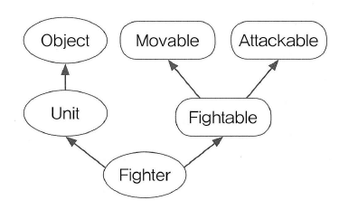

## 7.1 인터페이스란?
- 인터페이스는 일종의 추상클래스
- 인터페이스는 추상클래스처럼 추상메서드를 갖지만 추상클래스보다 추상화 정도가 높아서 추상 클래스와 달리 몸통을 갖춘 일반 메서드 또는 멤버 변수를 구성원으로 가질 수 없음
- 오직 추상메서드와 상수만을 멤버로 가질 수 있으며, 그 외의 다른 어떠한 요소도 허용하지 않음
- 인터페이스는 구현된 것은 아무것도 없고 밑그림만 그려져 있는 '기본 설계도'라고 할 수 있음

인터페이스의 멤버들은 다음과 같은 제약 사항 존재
1. 모든 멤버변수는 public static final 이어ㅑ 하며, 이를 생략할 수 있다
2. 모든 메서드는 public abstract 이어야 하며, 이를 생략할 수 있다. 
   단, static 메서드와 디폴트 메서드는 예외(JDK1.8)

- 인터페이스에 정의된 모든 멤버에 예외 없이 적용되는 사항이므로 제어자를 생략할 수 있는 것, 생략된 제어자는 컴파일 시 컴파일러가 자동 추가
- 원래 인터페이스의 모든 메서드는 추상 메서드이어야 하는데, JDK1.8부터 인터페이스에 static 메서드와 디폴트 메서드(default method)의 추가를 허용하는 방향으로 변경됨

## 7.3 인터페이스의 상속
- 인터페이스는 인터페이스로부터만 상속받을 수 있고, 클래스와 달리 다중상속이 가능하다.

## 7.4 인터페이스의 구현
- 인터페이스도 추상클래스처럼 그 자체로는 인스턴스를 생성할 수 없음
  - 자신에 정의된 추상메서드의 몸통을 만들어주는 클래스를 작성해야 함
  - 인터페이스는 구현한다는 의미로 implements 를 사용
- 만일 구현하는 인터페이스의 메서드 중 일부만 구현한다면, abstract를 붙여서 추상클래스로 선언해야 함
- 그리고 상속과 구현을 동시에 할 수 도 있음

```java
public class FighterTest {
    public static void main(String[] args) {
        Fighter f = new Fighter();

        if (f instanceof Unit) {
            System.out.println("f는 Unit 클래스의 자손입니다.");
        }

        if (f instanceof Fightable) {
            System.out.println("f는 Fightable 인터페이스를 구현했습니다.");
        }

        if (f instanceof Movable) {
            System.out.println("f는 Movable인터페이스를 구현했습니다.");
        }

        if (f instanceof Attackable) {
            System.out.println("f는 Attackable인터페이스를 구현했습니다.");
        }

        if (f instanceof Object) {
            System.out.println("f는 Object클래스의 자손입니다.");
        }
    }
}

class Fighter extends Unit implements Fightable {

    @Override
    public void attack(Unit u) {

    }

    @Override
    public void move(int x, int y) {

    }
}

class Unit {
    int currentHp; // 유닛의 체력
    int x; // 유닛의 x 좌표
    int y; // 유닛의 y 좌표
}
interface Fightable extends Movable, Attackable {

}
interface Movable {
    void move(int x, int y);
}

interface Attackable {
    void attack(Unit u);
}

```

- 예제에 사용된 클래스와 인터페이스간의 관계 그림

- 여기서 주의깊게 봐야 할 것은 Movable 인터페이스에 정의된 'void move(int x, int y)'를 Fighter 클래스에서 구현할 때 접근 제어자를 public 으로 했다는 것
- 오버라이딩 할 때는 조상의 메서드보다 넓은 범위의 접근 제어자를 지정해야 하므로 실제 구현할 때는 접근 제어자를 public 으로 한 것